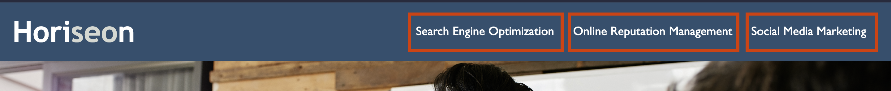

# Horiseon

## Description

The refactoring of this webpage intends to ensure the website's accessibility features, provide a detailed description of the website's title, and ensure that the HTML's code elements are concise and follow logical structuring independent of the page’s styling.

[Click here to visit the website](https://marcusmr15.github.io/horiseon-refactoring/)

## Installation

N/A

## Usage

This website was designed to inform the user about different Internet tools that can be used to make a business grow. Three topics can be observed, these include:
- Search Engine Optimization
- Online Reputation Management
- Social Media Marketing

The topics' titles are also displayed to the right of the website's name (Horiseon) within the header, and they can be clicked on to take the user directly to that topic's description on the webpage.

Alongside the main topics, three advantages of applying them are observed on the right side of the webpage, which are:
- Lead Generation
- Brand Awareness
- Cost Management

## Credits

Horiseon Social Solution Services, Inc.

## License

This repository does not have a specific license.